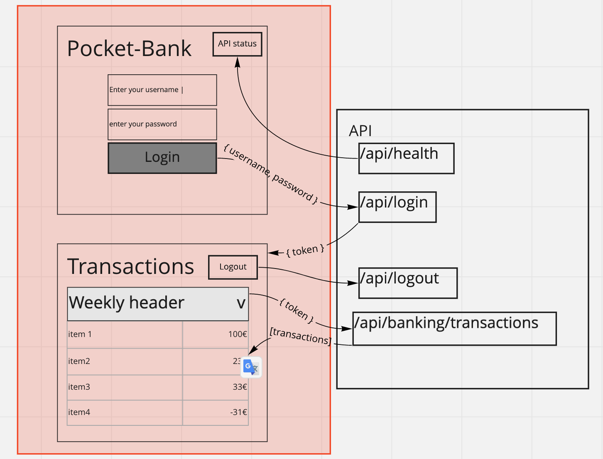

# FinnoConsult Interview

## Welcome!
**Dear Applicant,**

We warmly welcome you on behalf of the  development team!

This is the welcome page of your `HomeWork`, which is a blanket project, generated using [Nx, a Smart, Extensible Build Framework.](https://nx.dev)

> 💡 If you are unfamiliar with Nx, might worth checking their [few minutes intro](https://nx.dev/l/n/getting-started/intro)

 
 
 
 

# Your Task

We would like you to demonstrate your development skills and shine while creating the default pages of a `Pocket-bank` web application optimized for mobile layout.

## Fork the repo

Please fork this repo to your private GitHub user, so that you can commit to your own repo directly.

You can make your forked repo public. Anyway you'll benefit from having a new pet-project under your own github profile.

We expect you to send a `pull request`, merging back your forked repository to our original repository after completing your tasks defined below.
 
## Perform the task
### Frontend Components and Workflow
You need to comply with the following Frontend UI workflow according to the wireframe, your tasks are indicated in `red`:

The workflow:
  - The user need to log into the mobile app. Any username & password are accepted.
  - The transaction page shall be shown after successful login.
    - The transaction list is protected, so JWT token has to be specified

You can create (or generate using Nx) your components under `apps/pocket-bank` project.

We prefer to see **state of art React solutions**, which shall utilize Function Components, Hooks.

You also need to make api calls from frontend to backend, which you shall cover with **your best practice solution**.

#### **Your tasks are**:
<ol>
<li>
        Login Page
        <ul>
          <li>Create a Login page layout</li>
          <li>Login form shall have username and password</li>
          <li>
            Post the collected data of the form to endpoint <u>/api/login</u> in JSON
          </li>
          <li>Store authentication (JWT) data from response</li>
        </ul>
      </li>
      <li>
        Transaction list page
        <ul>
          <li>Create page layout</li>
          <li>
            Retrieve transactions data from the server from
            <u>/api/banking/transaction</u> endpoint
            <ul>
              Help of <b>functional programming on Arrays</b>:
              <li>Sort list by date descending</li>
              <li>
                generate and add unique id for all items (range 1000-9999),
                based on order
              </li>
              <li>
                format nicely expenses with
                <b style={{ color: '#e00000' }}>red</b> color, income as
                <b style={{ color: 'green' }}>green</b>
              </li>
              <li>
                aggregate sum of transaction amounts weekly(or monthly) based on
                date (display, total sum, expense and income separately)
              </li>
            </ul>
          </li>
          <li>
            Create list render component
            <ul>
              <li>
                Layout & behavior to be followed:
                (You can make your design close to this, but does not need to be pixel perfect, also the color scheme can be your preference )
                
              </li>
              <li>
                Apply weekly headers to transactions, and enlist all belonging
                transactions underneath
              </li>
              <li>
                Weekly headers shall be sticky on scroll, see
                <a
                  href="https://github.com/finnoconsult/interview-test-transactions/blob/main/transaction-list-sample.mov?raw=true"
                  target="_blank"
                  rel="noreferrer"
                >
                  see above video for reference
                </a>
              </li>
            </ul>
          </li>
        </ul>
      </li>
      </ol>

**Above task shall be completed in 3-5 hours**

> Optional: Bonus features if you still have more time or in favor to complete the following additions:
> - logout button and call /api/logout
> - open / collapse weekly sections in transaction list

### Backend

The backend is an `express` application which mockes everything you need, and can be found in `apps/api`.

Ideally you would not need to amend the backend, however, you are free to modify, extend, add any libraries into that.

Your mock backend listens on port 3333, and every endpoint you'd need for the exercise is defined in main.ts, such as:
- /api/login, method: POST, payload: {username, password} as correctly formatted json, return fake JWT as {token} in respone body.
- /api/logout, method: POST
- /api/health

Protected endpoints, to be accessed by providing the JWT token as Bearer Authorization.
- /api/banking/transactions
- /api/banking/partners

 
 
 
 
 
 

# How to work with this repo
## Adding capabilities to your workspace

You are free to add any libraries, components, new features and files of your preference, with or without Nx.

However, Nx supports many plugins which add capabilities for developing different types of applications and different tools which might accelerate your work.

These capabilities include generating applications, libraries, etc as well as the devtools to test, and build projects as well.

Some core plugins were already added: `@nrwl/react, @nrwl/web, @nrwl/express, @nrwl/node`
Currently the backend is an `express` app and the frontend is `React`.

> 💡 If you'd like to add support for other frameworks or plugins, you can [check the community plugins](https://nx.dev/community) or add [Nest](https://nestjs.com) by invoking `npm install --save-dev @nrwl/nest`

## Generate a library

Run `nx g @nrwl/react:lib my-lib` to generate a library.

> 💡 You can also use any of the plugins above to generate libraries as well.

Libraries are shareable across libraries and applications. They can be imported from `@finnoconsult-test-trivia/mylib`.

## Code scaffolding

Run `nx g @nrwl/react:component my-component --project=my-app` to generate a new component.

## Run the Development server

As this project has both a frontend and backend, you need to run both of them for your best development experience, with the command `yarn dev`.

Navigate to `http://localhost:4200/`. The app will automatically reload if you change any of the source files.

The backend will listend on `http://localhost:3333/` and your frontend will automatically look for these endpoints.

 
 
 
 
 
 
 
 
 
 
 
 

# This is what you ain't gonna need most likely:

## Generate a new application

When using Nx, you can create multiple applications and libraries in the same workspace.

Run `nx g @nrwl/react:app my-app` to generate a new application (either new microfrontend or microbackend) under `apps` folder.

> You can use any of the plugins above to generate applications as well.

## Build

Run `nx build my-app` to build the project. The build artifacts will be stored in the `dist/` directory. Use the `--prod` flag for a production build.

## Running unit tests

Run `nx test my-app` to execute the unit tests via [Jest](https://jestjs.io).

Run `nx affected:test` to execute the unit tests affected by a change.

## Running end-to-end tests

Run `ng e2e my-app` to execute the end-to-end tests via [Cypress](https://www.cypress.io).

Run `nx affected:e2e` to execute the end-to-end tests affected by a change.

## Understand your workspace

Run `nx dep-graph` to see a diagram of the dependencies of your projects.

## Further help

Visit the [Nx Documentation](https://nx.dev) to learn more.

